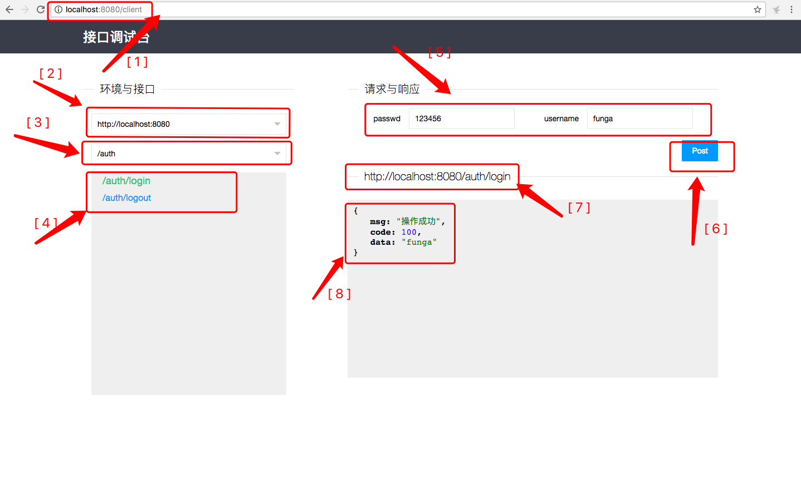

### 项目简介
本项目为基于Springboot项目的接口调试台组件。

### 如何使用
Web项目开放中，接口调试并不是十分方便，如果有一个可视化的界面能够自动所有写好的接口展示出来，并且能够输入参数即可发送请求，并且获得参数，这市多么完美的事情。
本项目实现的就是这个功能。

如上图所示：

【1】调试台首页为／client；

【2】环境地址可选，本地地址为自动获取，可以配置上测试环境、预发布环境等；

【3】获取所有符合条件加有@RestController注解的Controller，这里展示的是Controller上的@RequestMapping值；

【4】这里展示Controller下面的方法路径；

【5】自动获取方法需要的参数类型和参数名；

【6】根据请求参数注解生成可执行的请求方式；

【7】请求后这里现实请求的全路径；

【8】格式化的标准JSON返回；

### 约束：

- 所有接口类Controller必须使用@RestController注解；
- 在Controller上加上@RequestMapping注解；
- Post接口使用@PostMapping注解，Get注解使用@GetMapping，都支持使用@RequestMapping；
- 依赖相关前端框架和若干Java库

欢迎在项目中引用。